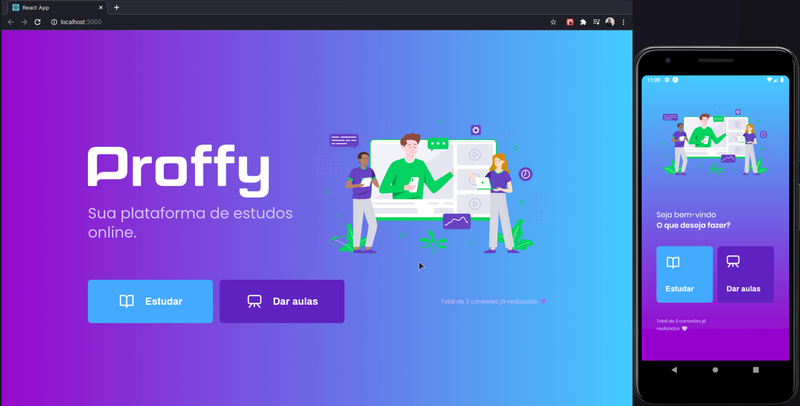

<h1 align="center">
  
</h1>

<h2>
  
</h2>

<p align="center">
  

  <a href="https://www.linkedin.com/in/helitonoliveira/">
    
  </a>

  

  <a href="https://github.com/heliton1988/bootcamp-gostack-fastfeet/stargazers">
    
  </a>
</p>

<p align="center">
  projeto em desenvolvimento...
  
</p>

## **Sobre**

Proffy é uma aplicação que foi desenvolvida na **Next Level Week**, treinamento oferecido pela **Rocketseat**. Nela é possível que professores/instrutores possam criar um cadastro informando a matéria de sua escialidade, dias da semana e horaŕios que estará disponível para ministrar as aulas.

Por outro lado é possível que um aluno, filtre por matérias de interessa para estudo e encontre os professores para que possa marcar as aulas. O aluno também pode favoritar ou desfavoritar um ou mais professos.

## **Como utilizar**

Para clonar e rodar essa aplicação é necessário ter as seguintes ferramentas instaladas em seu computador; `Git`, `Node.js v12.16.2` ou superior, `yarn v1.22.4`. 

* **Passo 1**

  ```bash
  ## Clone o repositório
  $ git clone https://github.com/heliton1988/proffy.git 

  ```

* **Passo 2**

  rodar o back-end;

  ```bash
  ## Acesse a pasta do back-end
  $ cd server

  ## Instale todas dependências
  $ yarn

  ## rode o servidor
  $ yarn:server

  ## rode as migrations
  $ yarn knex:migrate
  ```

* **Passo 3**

  rodar o front-end web da aplicação;

  ```bash
  ## apartir da raiz do repositório clonado acesse a pasta do front-end web da aplicação.
  $ cd web

  ## instale todas as dependências
  $ yarn

  ## dê o start no fron-end
  $ yarn start
  ```

* **Passo 4**

  roda o mobile da aplicação

  ```bash
  ## apartir da rais do repositório clonado acesse a pasta mobile
  $ cd mobile

  ## instale todas as dependências
  $ yarn

  ## start no mobile da aplicação
  $ yarn start
  ```